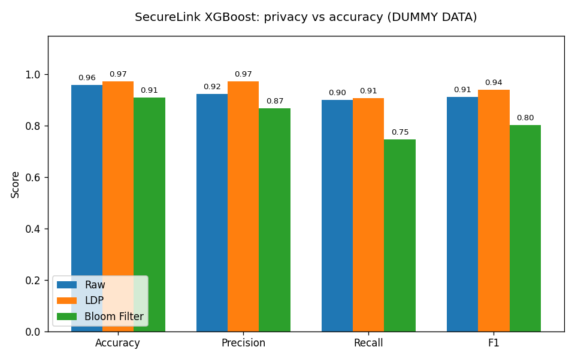
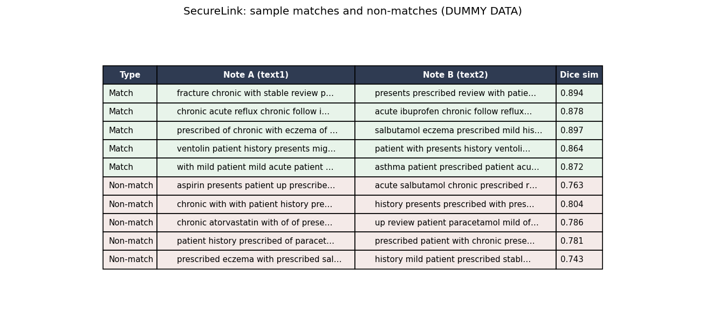

# SecureLink: Privacy-Preserving Record Linkage with XGBoost

Project highlight from **COMP3850 Computing Industry Project**, Macquarie University School of Computing (S1 2025, Group 46, Cybersecurity stream).

**My role:** Developer, XGBoost model owner.

## Overview

SecureLink matches records belonging to the same person across two separate datasets without exposing the underlying sensitive data. It was built for a healthcare context, where two parties may hold records about the same patient but cannot legally share raw clinical text. The system links data in an encoded, noise-protected form using **Bloom filter encoding** and **Local Differential Privacy (LDP)**. I designed, built, integrated, and evaluated the **XGBoost** component.

## What I built

Trained XGBoost as a binary classifier (match vs non-match) under three configurations, to measure the real cost of adding privacy:

- **Raw baseline.** Text turned into features with TF-IDF, reduced to 200 dimensions with Truncated SVD. No privacy applied.
- **Local Differential Privacy (LDP).** Calibrated random noise added to the feature vectors, with noise strength set by a privacy budget (epsilon).
- **Bloom filter encoding.** Records hashed into bit vectors and compared with Dice similarity, using that score as the model input.

## Key result (epsilon = 7)

Adding LDP privacy cost only about **1.7% in F1** versus the raw baseline, showing strong privacy protection at minimal accuracy loss. The Bloom filter approach traded more recall for its privacy guarantees.

| Configuration | F1 | Accuracy | Precision | Recall |
|---|---|---|---|---|
| Raw XGBoost (baseline) | 0.9118 | 0.9131 | 0.9237 | 0.9003 |
| LDP XGBoost (epsilon = 7) | 0.8960 | 0.8980 | 0.9118 | 0.8808 |
| Bloom Filter XGBoost (epsilon = 7) | 0.7252 | 0.8837 | 0.8754 | 0.6189 |

*Real project results (non-confidential).*

## Demonstration (synthetic data)

To illustrate the approach safely, the pipeline was re-run on randomly generated dummy data that contains no real records and no personal information. The pattern matches the real project: each privacy step costs some performance, and the Bloom filter loses the most on recall.

The demo is reproducible: see [securelink_xgboost_demo.py](securelink_xgboost_demo.py), which generates the synthetic data and produces both figures above.

## Full write-up

[Download the full project highlight (PDF)](SecureLink_Project_Highlight.pdf)

## Model design and decisions

The task was framed as binary classification: for each pair of records, predict whether they refer to the same entity (match) or not (non-match). Because real linkage data contains far more non-matching pairs than true matches, the Bloom filter dataset was rebalanced to a 3:1 ratio of non-matches to matches before training, so the model would not simply default to predicting "non-match".

Feature design differed by configuration. The raw and LDP models used 200 numeric features (100 Truncated SVD components from each of the two text fields), while the Bloom filter model used a single feature: the Dice similarity between the two encoded records. All configurations were trained on over a thousand record pairs and evaluated on a 70/30 train/test split with a fixed random seed, reported on Accuracy, Precision, Recall, and F1.

XGBoost was run with default hyperparameters as a deliberate baseline, since the aim was to compare the three privacy configurations on equal footing rather than chase peak accuracy. A clear next step would be tuning scale_pos_weight to reflect the class imbalance, alongside max_depth, learning_rate, and n_estimators via grid or randomised search.

## Tools and skills

Python, XGBoost, scikit-learn (TF-IDF, Truncated SVD), Bloom filter encoding, Local Differential Privacy, React (dashboard integration), Agile / GitHub / Kanban.

## Confidentiality

Source code, algorithms, and the sponsor datasets remain confidential to the university research project. This repository presents methodology, non-confidential results, and synthetic-data demonstrations only.
